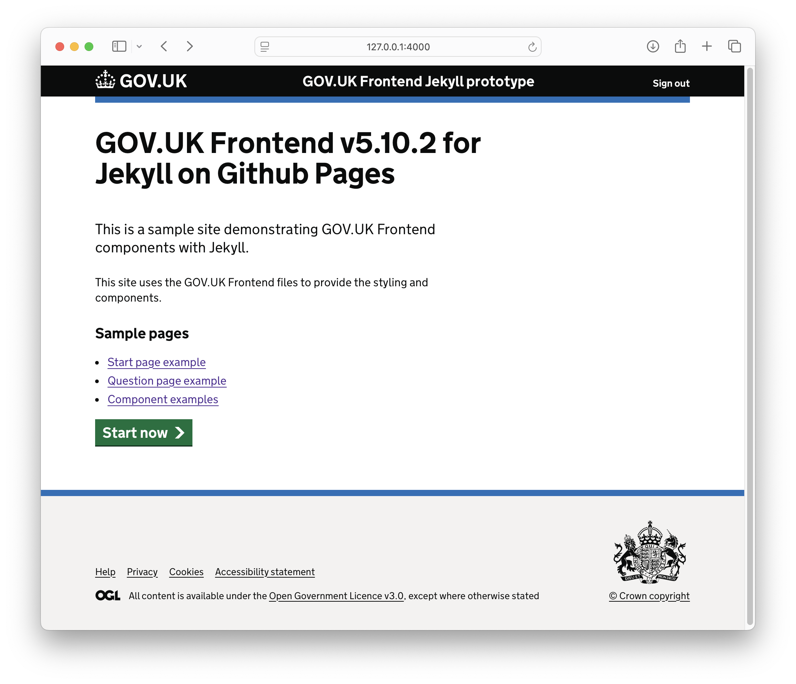

# GOV.UK Frontend Jekyll Integration



This project provides a set of modular Python scripts to easily integrate GOV.UK Frontend with Jekyll static sites. The scripts support both self-hosted assets (default) for offline development and CDN-based assets for online development.

## Features

- **Dual Asset Mode**: Choose between self-hosted assets (default) or CDN-based assets
- **Complete Jekyll Structure**: Creates a fully functional Jekyll site with GOV.UK Frontend
- **Sample Pages**: Includes example pages demonstrating various GOV.UK components
- **Easy to Use**: Simple command-line interface with minimal dependencies
- **Offline Development**: Self-hosted mode works completely offline once assets are downloaded

## Scripts Overview

The integration is broken down into modular scripts:

1. **Module 1: Asset Download** - Downloads and extracts GOV.UK Frontend assets for self-hosting
2. **Module 2: Jekyll Structure Creation** - Creates a basic Jekyll site structure with GOV.UK Frontend
3. **Module 3: Sample Pages Generation** - Creates sample pages demonstrating GOV.UK components

## Getting Started

### Prerequisites

- Python 3.6+
- Ruby and Jekyll installed on your system

### Quick Start

1. Clone or download this repository
2. Run the scripts in sequence:

#### For Self-hosted Mode (Default, works offline)

```bash
# Create a new Jekyll site with self-hosted GOV.UK Frontend assets
python module2_jekyll_structure.py my-govuk-site

# Add sample pages
python module3_sample_pages.py my-govuk-site

# Start the Jekyll server
cd my-govuk-site
bundle install --path vendor/bundle
bundle exec jekyll serve
```

#### For CDN Mode (Requires internet connection)

```bash
# Create a new Jekyll site with GOV.UK Frontend from CDN
python module2_jekyll_structure.py my-govuk-site-cdn --cdn

# Add sample pages
python module3_sample_pages.py my-govuk-site-cdn

# Start the Jekyll server
cd my-govuk-site-cdn
bundle install --path vendor/bundle
bundle exec jekyll serve
```

3. Visit http://localhost:4000 to see your GOV.UK Frontend Jekyll site

## Script Details

### Module 1: Asset Download

Downloads GOV.UK Frontend assets for self-hosting.

```bash
python module1_download_assets.py [output_dir] [--version VERSION]
```

Arguments:
- `output_dir`: Directory to save the assets (default: ./assets)
- `--version`: Version of GOV.UK Frontend to download (default: v5.10.2)

This script:
- Downloads the specified version of GOV.UK Frontend from GitHub
- Extracts CSS, JavaScript, fonts, and images
- Organizes assets in the output directory

Note: This script is automatically called by Module 2 when using self-hosted mode.

### Module 2: Jekyll Structure Creation

Creates a basic Jekyll site structure with GOV.UK Frontend.

```bash
python module2_jekyll_structure.py [output_dir] [--site-name NAME] [--cdn]
```

Arguments:
- `output_dir`: Directory to create the Jekyll site (default: current directory)
- `--site-name`: Name of the Jekyll site (default: GOV.UK Frontend Jekyll Site)
- `--cdn`: Use CDN for GOV.UK Frontend assets instead of self-hosted files

This script:
- Creates the Jekyll directory structure
- Sets up _config.yml and Gemfile
- Creates a default layout using GOV.UK Frontend (self-hosted or CDN)
- Creates a basic index page
- Downloads assets if using self-hosted mode

### Module 3: Sample Pages Generation

Creates sample pages demonstrating GOV.UK Frontend components.

```bash
python module3_sample_pages.py [site_dir]
```

Arguments:
- `site_dir`: Directory of the Jekyll site (default: test_jekyll_site)

This script creates:
- A start page example
- A question page example with form elements
- A components page showcasing various GOV.UK Frontend components

## Choosing Between Self-hosted and CDN

### Self-hosted Mode (Default)

**Advantages:**
- Works offline once assets are downloaded
- Consistent version control across all assets
- No dependency on external services
- Better for development environments

**Disadvantages:**
- Requires more disk space
- Manual updates needed for new GOV.UK Frontend versions

### CDN Mode

**Advantages:**
- Smaller project footprint
- Automatic caching and performance optimizations
- No need to manage asset files
- Better for production environments

**Disadvantages:**
- Requires internet connection
- Potential for version inconsistencies if CDN changes

## Troubleshooting

### Bundle Install Permission Issues

If you encounter permission errors during `bundle install`, use the local path option:

```bash
bundle install --path vendor/bundle
```

This installs gems to a local directory instead of system directories.

### Jekyll Build Issues

If Jekyll fails to build:

1. Make sure you have the latest version of Jekyll installed
2. Check that your Ruby version is compatible (2.5.0+ recommended)
3. Try running `bundle update` to update dependencies

### Asset Download Issues

If asset download fails in self-hosted mode:

1. Check your internet connection
2. Verify the version number is valid
3. Try downloading assets manually from the [GOV.UK Frontend releases page](https://github.com/alphagov/govuk-frontend/releases)

## Customization

### Using Different GOV.UK Frontend Version

Edit the `module2_jekyll_structure.py` file and change the `GOVUK_FRONTEND_VERSION` variable.

### Adding Custom Styles

Add your custom styles to `assets/css/custom.css` in your Jekyll site.

### Creating Additional Pages

Create new Markdown files in your Jekyll site directory with the GOV.UK layout:

```markdown
---
layout: govuk-default
title: Your Page Title
---

<div class="govuk-grid-row">
  <div class="govuk-grid-column-two-thirds">
    <h1 class="govuk-heading-xl">Your Page Heading</h1>
    <!-- Your content here -->
  </div>
</div>
```

## License

This project is licensed under the MIT License - see the LICENSE file for details.
